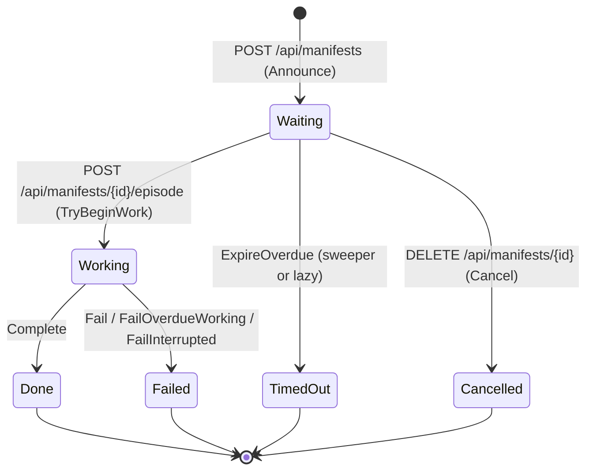
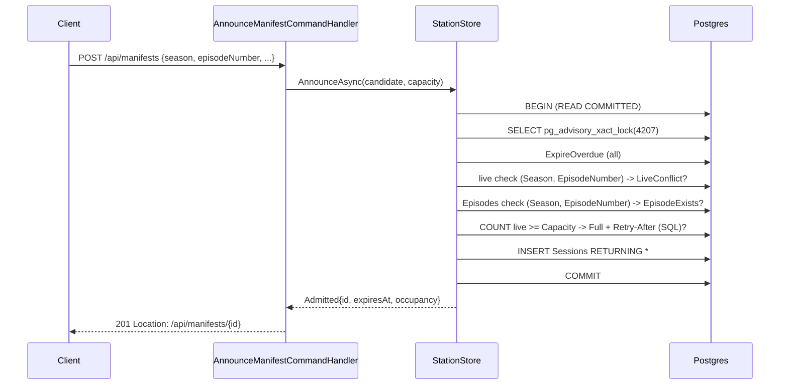

# Episode Ingestion Station — Technical Requirements Document

Version 1.1 — binding for the implementation of manifests, sessions and deliveries in the AdventureTime solution. Every requirement is numbered TR-n. MUST/SHOULD/MAY are used in the RFC 2119 sense. Where a detail is not fixed by the architecture decisions, the simplest consistent choice is taken and marked "(chosen here)".

## 1. Purpose and scope

The solution today ingests an Adventure Time episode with one unguarded `POST api/Episodes` and analyses it with an LLM in-request. This work replaces that path with a reservation system built on three nouns: a **manifest** (the promise: an episode announced before its content exists), a **session** (the station on air: the claimed slot, its state, and its clock), and an **episode** (the delivery, validated against the promise).

The manifest is (1) a contract the delivery is checked against, (2) a capacity claim — N slots are the only door in, and a sender learns "full" at the cheap step — and (3) the thing that makes cross-episode continuity well-defined.

Load-bearing mechanisms, in priority order:

1. Slot admission, atomic (§9.2).
2. The session state machine, with the slot released in the same statement as every terminal transition (§5).
3. The expiry sweeper, and the delivery-vs-expiry race with exactly one winner (§9.3).
4. The fulfilment check (TR-28).
5. Rehydration: a restart MUST NOT change what is on air except to fail interrupted work (TR-48).

Not load-bearing (correctness of the above never depends on them): dossier building, prompt assembly, continuity computation.

In scope: the `Sessions` table and migration, the store, the sweeper, the worker, rehydration, the manifests and station API, removal of the direct-ingestion endpoints, the stub analysis service, configuration, the seed script, and the test project. Out of scope: §13.

## 2. Current system (as-is)

Paths are relative to `/Users/steven/AdventureTime` unless absolute. Three projects, all `net10.0`, nullable and implicit usings enabled; no test project.

| Area | Real name | Relevance |
|---|---|---|
| Host | `AdventureTime/Program.cs` | Calls `context.Database.EnsureCreated()` (Development only); no hosted services; no schema path in Production. Replaced by `MigrateAsync` + rehydration (TR-48). |
| Controller | `AdventureTime/Controllers/EpisodesController.cs` | `[Route("api/[controller]")]`. `POST api/Episodes` (only ingestion path), `GET api/Episodes`, `GET api/Episodes/{id:int}`, and three actions whose `[Route("api/[controller]/analysis…")]` compose to the doubled paths `api/Episodes/api/Episodes/analysis[/quick|/{id:int}]`. Injects `AppDbContext`, `IDeepAnalysisService`, `IEpisodeAnalysisRepository` directly. |
| Entity/DTO | `AdventureTime.Application/Models/Episode.cs` | `Episode` is both the EF entity (table `"Episodes"`, unique index `IX_Episode_Season_Number` on `(Season, EpisodeNumber)`) and the API response type. Carries dormant `[Range(1,10)] Season` and `[Range(1,52)] EpisodeNumber`; the dataset has season 11. |
| Analysis entity | `AdventureTime.Application/Entities/EpisodeAnalysis/EpisodeAnalysisEntity.cs` | Table `"EpisodeAnalyses"`, jsonb string columns, `FromDomainModel`/`ToDomainModel`, `Episode? Episode` navigation, FK `EpisodeId -> Episodes`. Repositories `EpisodeRepository`/`EpisodeAnalysisRepository` each call `SaveChangesAsync` on their own. |
| DbContext | `AdventureTime.Infrastructure/Data/AppDbContext.cs` | `DbSet<Episode> Episodes`, `DbSet<EpisodeAnalysisEntity> EpisodeAnalyses`; jsonb lists via global-namespace `ListToJsonConverter<T>`; no `HasFilter`, no transactions, no raw SQL anywhere. |
| Migrations | `AdventureTime.Infrastructure/Migrations/` | One migration `20250806235645_InitialCreate`, never applied by the app; snapshot and Designer stale (ProductVersion 9.0.7, wrong CLR names). |
| DI | `AdventureTime.Infrastructure/DependencyInjection.cs` | `AddDbContext<AppDbContext>` (scoped, no retry strategy); provider chosen by top-level bool key `Claude`; typed HttpClients with `Timeout = 5 min`; `Configure<AnthropicConfig>("Anthropic")`, `Configure<OpenAiConfig>("OpenAi")`. |
| MediatR | `Application/DependencyInjection.cs`, `Commands/Episodes/CreateEpisode/*`, `Commands/Episodes/CreateEpisodeAnalysis/*`, `Queries/Episodes/GetEpisodeByIdQuery/*` | MediatR 13.0.0; `IRequestHandler<TCommand,TResult>`; hand-rolled result with `IsSuccess`, `FailureType?`, `ErrorMessage`, `ValidationErrors`, static factories. `Enums/FailureType.cs` = `{Conflict, ValidationFailed, InternalError}`. `GetEpisodeByIdQueryHandler` injects an unused `IDeepAnalysisService`. |
| LLM services | `Infrastructure/Services/ClaudeDeepAnalysisService.cs`, `Gpt5DeepAnalysisService.cs` | Implement `IDeepAnalysisService.AnalyzeEpisodeAsync(Episode, CancellationToken)`. `Gpt5DeepAnalysisService.CallGpt5Async` calls `SendAsync(httpRequest)` without the token. |
| Seed data | `AdventureTime/Episodes/*.json` (21 files) | camelCase keys identical to `CreateEpisodeCommand`; `s1e8__dungeon.json` carries `episodeNumber: 18`; bind-mounted at `/app/Episodes` by compose; not in publish output. |
| Packages | `AdventureTime.csproj`, `AdventureTime.Infrastructure.csproj` | API includes obsolete `MediatR.Extensions.Microsoft.DependencyInjection 11.1.0` (NU1608); Infrastructure lacks `Microsoft.Extensions.Hosting.Abstractions`. |
| Compose | `docker-compose.yml` | `postgres:15-alpine`, volume `adventuretime-data`, API on `5256:8080`, `ASPNETCORE_ENVIRONMENT=Development`. |
| Viewer | `/Users/steven/AdventureTimeViewer/src/services/episodeService.js` (sibling checkout, not in this repository) | Read-only React client; calls only `GET api/Episodes` and `GET api/Episodes/{id}`. Unaffected by this work; verified against that external checkout. |

## 3. Architecture overview

### 3.1 Components and responsibilities

| Component | Project / file | Responsibility |
|---|---|---|
| `Session`, `SessionState` | `Application/Entities/Station/Session.cs`, `Enums/SessionState.cs` | Row shape of `"Sessions"` (§6). |
| `SessionTransitions`, `DeliveryValidator`, `FulfilmentFlags`, `EpisodeMapper`, `StationJson` | `Application/Station/` | Pure functions, unit-testable without a database. |
| `IStationStore` → `StationSql`, `StationStore` | `Application/Interfaces/IStationStore.cs`; `Infrastructure/Station/StationSql.cs`, `StationStore.cs`, `StationRows.cs` | Every conditional statement, admission, Complete/Fail, continuity load, station view; raw parameterized SQL over `AppDbContext`; the only writer of `"Sessions"`. |
| `StationSweeper` | `Infrastructure/Station/StationSweeper.cs` | `BackgroundService`; each tick `ExpireOverdue` then `FailOverdueWorking`. |
| `IAnalysisQueue` / `AnalysisQueue`, `AnalysisWorker` | `Application/Interfaces/IAnalysisQueue.cs`; `Infrastructure/Station/AnalysisQueue.cs`, `AnalysisWorker.cs` | Post-commit signal; one tracked `Task` per Working session; 30 s orphan scan; calls `Complete`/`Fail`. |
| `StationOptions`, `ContinuityContext` | `Application/Config/StationOptions.cs`, `Application/Models/Continuity/ContinuityContext.cs` | `"Station"` options (§10.1); compact prior-episode context. |
| `StubDeepAnalysisService` | `Infrastructure/Services/StubDeepAnalysisService.cs` | Deterministic `IDeepAnalysisService`. |
| Commands / queries | `Application/Commands/Manifests/*`, `Queries/Manifests/*`, `Queries/Episodes/GetAllEpisodesQuery/` | MediatR handlers (§8.1). |
| `ManifestsController`, `StationController` | `AdventureTime/Controllers/` | HTTP surface (§7). |
| Rehydration | `AdventureTime/Program.cs` | `MigrateAsync` then `FailInterrupted`, before `app.Run()`. |
| `scripts/seed.sh`, `AdventureTime.Tests` | repo root; new xunit project | Seeding through the API (TR-56); §11. |

Layering is unchanged: Web → Application (contracts, DTOs, handlers, entities) ← Infrastructure (EF, SQL, hosted services, LLM clients). Controllers MUST NOT inject `AppDbContext`, `IStationStore` or `IDeepAnalysisService`. Hosted services live in Infrastructure, which gains `Microsoft.Extensions.Hosting.Abstractions 10.0.0`.

Data flow: announce writes one `Sessions` row → deliver moves it to Working, stages the episode as jsonb on the row and enqueues the id after commit → the worker analyses and, in one transaction, moves the row to Done and inserts `Episodes` + `EpisodeAnalyses` → clients poll `GET /api/manifests/{id}`. The sweeper and rehydration only ever move rows to terminal states.

### 3.2 State diagram



### 3.3 Sequence: announce



### 3.4 Sequence: deliver and process

```mermaid
sequenceDiagram
    participant C as Client
    participant H as DeliverEpisodeCommandHandler
    participant S as StationStore
    participant DB as Postgres
    participant Q as AnalysisQueue
    participant W as AnalysisWorker
    participant L as IDeepAnalysisService
    C->>H: POST /api/manifests/{id}/episode
    H->>S: ExpireOverdue(id); GetAsync(id) [AsNoTracking]
    S-->>H: null -> 404 | TimedOut -> 410 | other non-Waiting -> 409
    H->>H: DeliveryValidator -> 422 (all reasons); FulfilmentFlags
    H->>S: TryBeginWork(id, payload, flags)
    S->>DB: UPDATE ... WHERE Id AND State='Waiting' AND ExpiresAt > now()
    alt 1 row
        H->>Q: TryEnqueue(id) (after commit, CancellationToken.None)
        H->>S: GetAsync(id) [AsNoTracking]
        H-->>C: 202 {sessionId, Working, flags, workingDeadlineAt} from re-read
    else 0 rows
        H->>S: ExpireOverdue(id); GetAsync(id)
        H-->>C: 410 / 409 from re-read state
    end
    Q-->>W: id
    W->>S: GetForProcessingAsync(id) require Working; LoadContinuity
    W->>L: AnalyzeEpisodeAsync(episode, context, jobCts.Token)
    L-->>W: analysis
    W->>S: Complete(id, episode, analysis)
    S->>DB: BEGIN; UPDATE Sessions -> Done WHERE State='Working' (rows==1); INSERT Episodes + EpisodeAnalyses; COMMIT
    C->>H: GET /api/manifests/{id} -> 200 state Done, episodeId
```

### 3.5 Sequence: expiry, working deadline, rehydration

```mermaid
sequenceDiagram
    participant T as StationSweeper (PeriodicTimer)
    participant D as Delivery handler
    participant DB as Postgres
    participant P as Program.cs (boot)
    loop every Station:SweepInterval
        T->>DB: ExpireOverdue: State='Waiting' AND ExpiresAt <= now() -> TimedOut
        T->>DB: FailOverdueWorking: State='Working' AND WorkingDeadlineAt <= now() -> Failed
    end
    par race on one row
        D->>DB: TryBeginWork WHERE State='Waiting' AND ExpiresAt > now()
        T->>DB: ExpireOverdue WHERE State='Waiting' AND ExpiresAt <= now()
    end
    Note over DB: row lock serializes; the second statement re-evaluates its predicate and affects 0 rows
    Note over P: process restart
    P->>DB: Database.MigrateAsync()
    P->>DB: FailInterrupted: State='Working' -> Failed 'interrupted by restart'
    Note over P: Waiting rows untouched; app.Run()
```

## 4. Architecture decisions

| # | Decision | Rationale | Rejected alternative |
|---|---|---|---|
| A1 | Postgres is the single source of truth; occupancy is derived by `COUNT` of live rows. | Nothing to reconcile after a crash. | Counter row / in-memory semaphore. |
| A2 | Admission is one READ COMMITTED transaction under `pg_advisory_xact_lock`; partial unique index as backstop. | Serializes admission without raising isolation; the index guards lock-bypassing paths. | SERIALIZABLE with retry. |
| A3 | Full station → 429 + `Retry-After` ≥ 1 + `{capacity, occupancy, earliestExpiry}`. | The service is healthy; proxies and health checks must not react. | 503. |
| A4 | Capacity is configuration, read at startup; lowering never evicts. | Occupancy simply drains. | Hot reload with eviction. |
| A5 | Six states; every transition is one conditional `UPDATE` keyed on `(Id, from-state)`; 0 rows = lost the race → re-read, never retry. | Compare-and-set gives every race one winner. | Tracked entity + concurrency token + retry loops. |
| A6 | Clock predicates use `now()`; conditional statements are raw parameterized SQL through EF (`ExecuteSqlAsync` / `FromSql`). | One clock; exact statements can be reviewed. | `ExecuteUpdateAsync` with `DateTime.UtcNow`. |
| A7 | Working has a DB-visible deadline (`ProcessingTimeout + 30 s`) swept by the sweeper. | Orphaned Working rows always release. | Worker-only timeout. |
| A8 | Sweeper = `BackgroundService` + `PeriodicTimer` (TimeProvider), try/catch per tick. | `BackgroundServiceExceptionBehavior` would stop the host. | Quartz/Hangfire. |
| A9/A10 | Fulfilment order 404/410/409/422/202; validation and flags before the transaction; `TryBeginWork` is the transaction. | Reject only mis-filed or unprocessable deliveries; flag the rest. | Reject on any discrepancy. |
| A11 | Dedicated `DeliverEpisodeRequest`; episode staged as jsonb on the session. | Nothing in `Episodes` until Done. | Provisional `Episodes` row at delivery. |
| A12 | Outcome by polling; no idempotency key in v1. | Manifest ids are single-use, so a retried delivery's 409 means "accepted". | Idempotency-Key header. |
| A13 | Enqueue after commit with `CancellationToken.None`; `TryEnqueue` false is logged and recovered. | A signal for an uncommitted row is a lost wake-up. | Enqueue inside the transaction. |
| A14–A16 | Worker: bounded `Channel<Guid>`, one Task per id, scope per job, 30 s orphan scan, deadline CTS as the only clock, infinite HttpClient timeout. | In-flight analyses == Working rows; cancellation classification is unambiguous. | Worker-side concurrency limit. |
| A17 | Continuity via default interface method and compact context; notes in `"ContinuityNotesJson"`. | Existing implementations keep compiling. | New interface. |
| A18/A19 | Rehydration in `Program.cs` after `MigrateAsync`, before `app.Run()`; shutdown writes nothing. | Restart never changes what is on air except failing interrupted work. | Hosted-service ordering. |
| A20–A22 | One flat `"Sessions"` table; `"Episodes"."SessionId"` is the only link; EF migrations from now on. | Manifest and session are 1:1; readers join. | Separate `Manifests` table. |
| A23/A24 | Manifests API; `POST api/Episodes` → 410; analysis POST actions deleted; analysis GET re-routed. | No slot-free path; unreachable routes are not preserved. | Keep `POST api/Episodes` for admins. |
| A25 | The delivery is what gets stored; flags record the difference. | The manifest is the contract, not the data. | Overwrite delivery with manifest values. |
| A26–A28 | `StationOptions`; `Stub | Claude | OpenAi`; scoped `AppDbContext`; hosted services use scopes. | Existing options idiom; correct lifetimes. | Singleton context factory. |
| A30 | One application instance. | Orphan scan and rehydration assume it. | Leader election. |
| A31 | xunit + Testcontainers + `WebApplicationFactory`. | Races are tested on real Postgres. | In-memory provider (no advisory locks, no `now()`). |

## 5. Domain model and state machine

**TR-1** `SessionState` MUST be `enum SessionState { Waiting, Working, Done, Failed, TimedOut, Cancelled }` in `AdventureTime.Application/Enums/SessionState.cs`, stored as text via `HasConversion<string>()`. Terminal states: Done, Failed, TimedOut, Cancelled. Live states: Waiting, Working. There are no other states.

**TR-2** Occupancy MUST be computed as `SELECT count(*)::int FROM "Sessions" WHERE "State" IN ('Waiting','Working')` wherever it is reported (201 body, 429 body, `/api/station`). It is never stored.

**TR-3** Every transition MUST be exactly one conditional `UPDATE` whose predicate includes the from-state. A terminal transition MUST set `"EndedAt"=now()` and `"DeliveryPayload"=NULL` in the same statement. 0 rows affected MUST be handled by re-reading the row once (`AsNoTracking`) and acting on the real state; the write MUST NOT be retried. No transition leaves a terminal state.

**TR-4** Transition table (identifiers as in §6; parameters shown as `@name`):

| From | To | Trigger | Guard (in SQL) | Statement | Effect |
|---|---|---|---|---|---|
| (new) | Waiting | Announce: `POST /api/manifests` | advisory lock held; no live row for (Season, EpisodeNumber); no `"Episodes"` row for it; live count < Capacity | `Announce` (INSERT) | slot claimed; `ExpiresAt = now() + ttl`; 201 |
| Waiting | Working | Deliver: `POST /api/manifests/{id}/episode` after the fulfilment check | `"Id"=@id AND "State"='Waiting' AND "ExpiresAt" > now()` | `TryBeginWork` | payload, flags, `DeliveredAt`, `WorkingDeadlineAt` set; id enqueued after commit; 202 |
| Waiting | Cancelled | Cancel: `DELETE /api/manifests/{id}` | `"Id"=@id AND "State"='Waiting'` (no clock) | `Cancel` | slot released; `Reason='cancelled by announcer'`; 204 |
| Waiting | TimedOut | Expire: sweeper tick; announce step 2; delivery pre-read and 0-row fallback (id-scoped); cancel 0-row fallback (id-scoped) | `"State"='Waiting' AND "ExpiresAt" <= now()` [+ `AND "Id"=@id`] | `ExpireOverdue` | slot released; `Reason='ttl elapsed'` |
| Working | Done | Complete: `AnalysisWorker` | `"Id"=@id AND "State"='Working'` | `Complete` step 1 | `Episodes` + `EpisodeAnalyses` inserted in the same transaction; slot released |
| Working | Failed | Fail: `AnalysisWorker` | `"Id"=@id AND "State"='Working'` | `Fail` | `Reason` ∈ {`processing timeout`, `analysis error: <ExceptionType>`, `episode exists`, `missing payload`}; slot released |
| Working | Failed | WorkingDeadline: sweeper tick | `"State"='Working' AND "WorkingDeadlineAt" <= now()` | `FailOverdueWorking` | `Reason='working deadline exceeded'` |
| Working | Failed | Interrupted: boot (`Program.cs`) | `"State"='Working'` | `FailInterrupted` | `Reason='interrupted by restart'` |

Lost-the-slot is detected by `Complete` affecting 0 rows (TR-38); because the row is already terminal, the worker logs it and writes nothing (`Fail` would affect 0 rows by construction).

**TR-5** A pure function `SessionTransitions.IsLegal(SessionState? from, SessionState to, TransitionTrigger trigger)` MUST exist in `AdventureTime.Application/Station/SessionTransitions.cs`, with `enum TransitionTrigger { Announce, Deliver, Cancel, Expire, Complete, Fail, WorkingDeadline, Interrupted }`; `from == null` represents "(new)". It returns true for exactly the eight rows of TR-4 (five distinct (from, to) pairs between named states plus the announce row) and false for every other triple, including every triple from a terminal state. `SessionTransitions.IsTerminal(SessionState)` returns true for the four terminal states. It is unit-tested (§11.1); the store does not consult it at runtime (the SQL predicates are the runtime guard).

**TR-6** `Session` entity properties MUST map 1:1 to the columns of TR-8 with the same names and order; CLR types are `Guid`, `SessionState`, `int`, `string`/`string?`, `List<string>` (initialized to `new()`, mapped with `ListToJsonConverter<string>`), `DateTime`/`DateTime?`. `Flags` and `DeliveryPayload` are `string?` holding pre-serialized JSON (the `EpisodeAnalysisEntity` idiom). No navigation properties.

**TR-7** `record Flag(string Code, string Message)` and `static class FlagCode` live in `AdventureTime.Application/Station/Flag.cs`. The codes are exactly five: `CharacterAbsent`, `LocationAbsent`, `TitleMismatch`, `UnannouncedCharacter`, `FocusCharacterMismatch`. There is no runtime flag: the manifest carries no runtime field, so no comparison exists. `"Flags"` is a camelCase JSON array of `{code, message}`. `"DeliveryPayload"` holds the `Episode` materialized from `DeliverEpisodeRequest` (TR-25), serialized camelCase with `Id = 0`, `SessionId = <session id>`; it is written only by `TryBeginWork` and nulled by every terminal transition.

## 6. Data model and migration

### 6.1 Tables

**TR-8** Table `"Sessions"` (`DbSet<Session> Sessions` on `AppDbContext`):

| Column | Type | Null | Notes |
|---|---|---|---|
| `"Id"` | uuid | no | PK; generated in code by `Guid.CreateVersion7()`; `ValueGeneratedNever()` |
| `"State"` | text | no | `HasConversion<string>()`; values per TR-1 |
| `"Season"` | integer | no | |
| `"EpisodeNumber"` | integer | no | |
| `"Title"` | character varying(200) | no | |
| `"FocusCharacter"` | character varying(100) | yes | |
| `"ExpectedCharacters"` | jsonb | no | `ListToJsonConverter<string>` |
| `"ExpectedLocations"` | jsonb | no | same; `[]` when omitted |
| `"RequestedStages"` | jsonb | no | list of stage names |
| `"TtlSeconds"` | integer | no | |
| `"AnnouncedAt"` | timestamp with time zone | no | SQL `now()` at insert |
| `"ExpiresAt"` | timestamp with time zone | no | SQL `now() + make_interval(secs => @ttl)` |
| `"DeliveredAt"` | timestamp with time zone | yes | SQL `now()` in `TryBeginWork` |
| `"WorkingDeadlineAt"` | timestamp with time zone | yes | SQL `now() + ProcessingTimeout + 30 s` |
| `"EndedAt"` | timestamp with time zone | yes | SQL `now()` in every terminal transition |
| `"Reason"` | text | yes | |
| `"Flags"` | jsonb | yes | `string?` with `HasColumnType("jsonb")`; array of `{code, message}` |
| `"DeliveryPayload"` | jsonb | yes | `string?` with `HasColumnType("jsonb")`; serialized `Episode`; NULL in every terminal state |

Indexes, declared in `OnModelCreating`:

- `IX_Sessions_Live_Season_Episode` UNIQUE on `("Season","EpisodeNumber")`: `HasIndex(s => new { s.Season, s.EpisodeNumber }).IsUnique().HasFilter("\"State\" IN ('Waiting','Working')").HasDatabaseName("IX_Sessions_Live_Season_Episode")`. The `HasDatabaseName` call is mandatory; without it EF would name the index `IX_Sessions_Season_EpisodeNumber` and the tests of §11 would not find it.
- `("State","ExpiresAt")` and `("State","WorkingDeadlineAt")`, non-unique, with no `HasDatabaseName`; they keep EF's default names `IX_Sessions_State_ExpiresAt` and `IX_Sessions_State_WorkingDeadlineAt`.

Raw SQL writing jsonb columns MUST cast the parameter (`CAST(@p AS jsonb)`).

**TR-9** `"Episodes"` gains `"SessionId"` uuid NULL, UNIQUE index `IX_Episodes_SessionId` (Postgres allows multiple NULLs), FK `FK_Episodes_Sessions_SessionId -> "Sessions"("Id") ON DELETE RESTRICT`, declared `HasOne<Session>().WithOne().HasForeignKey<Episode>(e => e.SessionId).OnDelete(DeleteBehavior.Restrict)` with no navigation on either side (chosen here). `Episode` gains `public Guid? SessionId { get; set; }` after `DialogueLineCount`. No `Sessions.EpisodeId`, no `Episodes.Flags`. Existing rows keep `SessionId NULL`.

**TR-10** `"EpisodeAnalyses"` gains `"ContinuityNotesJson"` jsonb NULL. `EpisodeAnalysisEntity` gains `string? ContinuityNotesJson` (`HasColumnType("jsonb")`); `FromDomainModel` serializes `analysis.ContinuityNotes` (NULL when empty), `ToDomainModel` deserializes it (null → empty list). The domain `EpisodeAnalysis` gains `List<string> ContinuityNotes { get; set; } = [];`.

**TR-11** `[Range(1,10)]` on `Episode.Season` and `[Range(1,52)]` on `Episode.EpisodeNumber` MUST be removed.

**TR-12** `DateTime` values written to timestamptz columns from code (only `Episode.AirDate`, `Episode.CreatedAt`, `EpisodeAnalysisEntity.AnalysisDate`/`CreatedAt`) MUST have `Kind == Utc`. All `Sessions` timestamps are written by SQL `now()` or read back; application code MUST NOT assign `DateTime.UtcNow` to any `Session` timestamp property.

### 6.2 Migration procedure

**TR-13** Schema is managed by EF Core migrations from now on. Steps, executed from the repo root:

1. Repair the stale snapshot before changing the model: in `AdventureTime.Infrastructure/Migrations/AppDbContextModelSnapshot.cs` and `20250806235645_InitialCreate.Designer.cs` replace `"AdventureTime.Models.Episode"` with `"AdventureTime.Application.Models.Episode"` and `"AdventureTime.Application.Models.EpisodeAnalysisEntity"` with `"AdventureTime.Application.Entities.EpisodeAnalysis.EpisodeAnalysisEntity"`. Run `dotnet ef migrations add SnapshotCheck --project AdventureTime.Infrastructure --startup-project AdventureTime` and verify `Up()` and `Down()` are empty. Delete the two `*_SnapshotCheck*.cs` files by hand; do NOT run `dotnet ef migrations remove` (it reverts the snapshot). Keep the rewritten snapshot (ProductVersion 10.0.x).
2. Apply the model changes of TR-8..TR-11 to the entities and `AppDbContext.OnModelCreating`.
3. `dotnet ef migrations add AddStation --project AdventureTime.Infrastructure --startup-project AdventureTime`. `Up()` MUST contain exactly: `CreateTable("Sessions")`, `CreateIndex IX_Sessions_Live_Season_Episode` (unique, with the filter), `CreateIndex IX_Sessions_State_ExpiresAt`, `CreateIndex IX_Sessions_State_WorkingDeadlineAt`, `AddColumn<Guid>("SessionId", "Episodes")`, `CreateIndex IX_Episodes_SessionId` (unique), `AddForeignKey` (`ReferentialAction.Restrict`), `AddColumn<string>("ContinuityNotesJson", "EpisodeAnalyses")`. Anything else means step 1 was incomplete: stop and fix.
4. `Program.cs`: replace the `EnsureCreated` block with `await context.Database.MigrateAsync();` executed unconditionally (no environment gate), before rehydration and `app.Run()` (TR-48).

**TR-14** One-time upgrade for databases created by `EnsureCreated` (no `__EFMigrationsHistory`): `docker compose down -v`, `docker compose up -d --build`, then `scripts/seed.sh`. For a local non-compose database: drop and recreate `adventuretime`. This MUST be documented in the README section "Upgrading to migrations". No baseline-insert path is provided.

## 7. API specification

**TR-15** All bodies are JSON, camelCase; timestamps ISO-8601 UTC with `Z`; error bodies `{ "message": string, ... }` unless stated. `[ApiController]` automatic 400 stays enabled and `SuppressImplicitRequiredAttributeForNonNullableReferenceTypes` stays at its default (false). Consequently: `AnnounceManifestRequest` carries DataAnnotations and its non-nullable `string Title` and `List<string> ExpectedCharacters` are implicitly required, so a missing member is a framework 400 (intended). `DeliverEpisodeRequest` carries no DataAnnotations and every reference-type and struct member is declared nullable (TR-19), so model binding never rejects a syntactically valid body; every content problem of a delivery reaches the handler and is a 422 (TR-20). Non-GUID route ids fall to 404 through `{id:guid}`.

### 7.1 POST /api/manifests

**TR-16** Request `AnnounceManifestRequest` (`[JsonUnmappedMemberHandling(JsonUnmappedMemberHandling.Disallow)]`):

| Field | Type | Rule | Checked by |
|---|---|---|---|
| season | int | `[Range(1, int.MaxValue)]` | framework → 400 |
| episodeNumber | int | `[Range(1, int.MaxValue)]` | framework → 400 |
| title | string | `[Required]`, `[MaxLength(200)]`; non-blank after trim | framework; handler (`errors.title`) |
| expectedCharacters | List<string> | `[Required]`, `[MinLength(1)]`; every entry non-blank after trim | framework; handler (`errors.expectedCharacters`) |
| focusCharacter | string? | if present, MUST equal (ordinal-ignore-case, trimmed) an entry of expectedCharacters | handler (`errors.focusCharacter`) |
| expectedLocations | List<string>? | default `[]` | — |
| requestedStages | List<string>? | subset of `Sentiment, CharacterMoods, Relationships, Themes, StoryArc, KeyMoments`; default all six | handler (`errors.requestedStages`) |
| ttlSeconds | int? | default `Station:TtlDefault`; within `[Station:TtlMin, Station:TtlMax]` | handler (`errors.ttlSeconds`) |

Any other member (including `synopsis`, `plot`, `transcriptText`, `dialogueLineCount`) fails deserialization → 400. The handler-level rules (blank title, blank entries, focus character, stage names, ttl bounds) return `ValidationFailed` → 400 `{ "message": "validation failed", "errors": { "ttlSeconds": ["must be between 60 and 86400"] } }` (chosen here), with the keys named in the table. `title`, every `expectedCharacters`/`expectedLocations` entry and `focusCharacter` are trimmed before storage.

Example request:

```json
{ "season": 11, "episodeNumber": 1, "title": "The Unfinished Map",
  "focusCharacter": "Finn", "expectedCharacters": ["Finn", "Jake", "BMO"],
  "expectedLocations": ["Tree Fort"], "ttlSeconds": 600 }
```

| Status | When | Body / headers |
|---|---|---|
| 201 | admitted | `{ "id": "019...", "state": "Waiting", "expiresAt": "...Z", "occupancy": 1, "capacity": 3 }` (occupancy includes this session); `Location: /api/manifests/{id}` |
| 400 | DTO invalid, unmapped member, handler validation | `ValidationProblemDetails` or `{ "message", "errors" }` |
| 409 | live session for (season, episodeNumber) | `{ "message": "a live manifest exists for S11E01", "manifestId": "019...", "state": "Waiting" }` |
| 409 | `"Episodes"` row exists | `{ "message": "episode exists", "episodeId": 17 }` |
| 429 | live count ≥ Capacity | `Retry-After: 412`; `{ "capacity": 3, "occupancy": 3, "earliestExpiry": "...Z" }` (`earliestExpiry` null when no Waiting session; `Retry-After` then 30) |

### 7.2 GET /api/manifests/{id}

**TR-17** 200 body (never includes `DeliveryPayload`; built from `GetAsync`, which projects it as NULL):

```json
{ "id": "0192f1a0-...", "state": "Done", "season": 11, "episodeNumber": 1,
  "title": "The Unfinished Map", "focusCharacter": "Finn",
  "expectedCharacters": ["Finn","Jake","BMO"], "expectedLocations": ["Tree Fort"],
  "requestedStages": ["Sentiment","CharacterMoods","Relationships","Themes","StoryArc","KeyMoments"],
  "ttlSeconds": 600, "announcedAt": "...Z", "expiresAt": "...Z", "deliveredAt": "...Z",
  "workingDeadlineAt": "...Z", "endedAt": "...Z", "reason": null,
  "flags": [ { "code": "LocationAbsent", "message": "expected location 'Tree Fort' not found" } ],
  "episodeId": 17,
  "links": { "self": "/api/manifests/0192f1a0-...", "episode": "/api/episodes/17",
             "analysis": "/api/episodes/17/analysis" } }
```

`episodeId`, `links.episode`, `links.analysis` are present only when Done (resolved by `"Episodes"."SessionId" = id`); `links.deliver` only when Waiting. `flags` is `[]` before delivery. 404 `{ "message": "manifest not found" }` for an unknown id.

### 7.3 DELETE /api/manifests/{id}

**TR-18** 204 when `Cancel` affects 1 row or the re-read state is already Cancelled (idempotent). 404 unknown id. 409 `{ "message": "cannot cancel", "state": "Working" }` for Working, Done, Failed, TimedOut. `Cancel` does not check the clock: a Waiting row past its TTL but not yet swept is Cancelled. On 0 rows the handler runs id-scoped `ExpireOverdue`, re-reads, and reports TimedOut as 409.

### 7.4 POST /api/manifests/{id}/episode

**TR-19** Request `DeliverEpisodeRequest` (no DataAnnotations; every member except `season` and `episodeNumber` is nullable so that binding never fails; the 21 seed files are valid bodies as-is):

| Field | CLR type | Rule (checked by `DeliveryValidator`; message on failure) |
|---|---|---|
| title | `string?` | `title is required` when null/blank after trim; `title exceeds 200 characters` |
| season, episodeNumber | `int` | `season must be >= 1` / `episodeNumber must be >= 1`; `season 12 does not match manifest season 11` / episodeNumber equivalent |
| airDate | `DateTimeOffset?` | `airDate is required` when null; stored as `airDate.Value.UtcDateTime` |
| runtimeMinutes | `double?` | null → 11.0; non-null MUST be > 0 (`runtimeMinutes must be > 0`) |
| focusCharacter, synopsis, productionCode | `string?` | ≤ 100 / ≤ 2000 / ≤ 20 characters after trim |
| plot | `string?` | none |
| dialogueLineCount | `int?` | none |
| transcriptText | `string?` | NUL (`\0`) characters stripped, then `transcriptText is required` when null/empty after trim |
| majorCharacters, minorCharacters, locations | `List<string>?` | null → `[]`; entries trimmed, blank entries dropped |

Example (fields abbreviated):

```json
{ "title": "The Unfinished Map", "season": 11, "episodeNumber": 1, "productionCode": "FAN-1101",
  "airDate": "2026-09-14T00:00:00Z", "runtimeMinutes": 11.0, "focusCharacter": "Finn",
  "synopsis": "...", "plot": "...", "majorCharacters": ["Finn","Jake"], "minorCharacters": ["BMO","Marceline"],
  "locations": ["Tree Fort"], "dialogueLineCount": 143, "transcriptText": "Finn: ..." }
```

**TR-20** Outcomes, evaluated in this order (TR-28):

| Status | When | Body |
|---|---|---|
| 404 | id unknown | `{ "message": "manifest not found" }` |
| 410 | TimedOut (swept earlier, or expired lazily by the id-scoped `ExpireOverdue` of TR-28) | `{ "message": "manifest expired", "state": "TimedOut", "expiresAt": "...Z" }` |
| 409 | Working/Done (`"already fulfilled"`), Cancelled (`"cancelled"`), Failed (`"re-announce"`) | `{ "message": "already fulfilled", "state": "Done" }` |
| 422 | identity mismatch, empty/missing transcript, any TR-19 rule failure; nothing changes | `{ "message": "delivery rejected", "reasons": [ "season 12 does not match manifest season 11", "transcriptText is required" ] }` — every reason |
| 202 | Waiting→Working | `{ "sessionId": "019...", "state": "Working", "flags": [ { "code": "UnannouncedCharacter", "message": "'Marceline' present in delivery but not announced" } ], "workingDeadlineAt": "...Z" }`; `Location: /api/manifests/{id}`; body built from a re-read |

Malformed JSON remains a framework 400. A retried delivery after a lost 202 receives 409 with state Working/Done: "your delivery was accepted" (A12).

### 7.5 GET /api/station

**TR-21** Always 200:

```json
{ "capacity": 3, "occupancy": 2,
  "live": [ { "id": "019...", "state": "Waiting", "season": 11, "episodeNumber": 2, "title": "Jake's Nap",
              "announcedAt": "...Z", "expiresAt": "...Z", "deliveredAt": null, "workingDeadlineAt": null } ],
  "recent": [ { "id": "019...", "state": "Done", "season": 11, "episodeNumber": 1, "title": "The Unfinished Map",
                "endedAt": "...Z", "reason": null } ] }
```

`live` = all Waiting/Working rows ordered by `AnnouncedAt`; `recent` = the 20 most recent terminal rows by `EndedAt` desc (chosen here). Metadata only: no payload, no flags.

### 7.6 Episodes controller

**TR-22** `POST api/Episodes` MUST return 410 with `{ "message": "removed; announce a manifest at POST /api/manifests, then deliver to POST /api/manifests/{id}/episode", "manifests": "/api/manifests" }` and MUST NOT call MediatR or `IDeepAnalysisService`. The actions `CreateEpisodeAnalysis` and `QuickEpisodeAnalysis` and the folder `Commands/Episodes/CreateEpisodeAnalysis/*` are DELETED; their composed routes are not preserved (they were unreachable by design). `GetEpisodeAnalysis` is re-routed to `[HttpGet("{id:int}/analysis")]`, effective `GET api/episodes/{id:int}/analysis`, behavior otherwise unchanged. `GET api/Episodes` and `GET api/Episodes/{id:int}` are kept; responses gain only `episode.sessionId` and `analysis.continuityNotes`. The React viewer at `/Users/steven/AdventureTimeViewer` calls only the two episode GETs.

## 8. Component requirements

### 8.1 Application layer

**TR-23** DTOs in `Application/Dtos/Manifests/`: `AnnounceManifestRequest` (TR-16, DataAnnotations plus the Disallow attribute), `DeliverEpisodeRequest` (TR-19, no DataAnnotations, nullable members), `AnnounceManifestResponse`, `DeliverEpisodeResponse`, `ManifestResponse` (nested `ManifestLinks`), `StationResponse`. `DeliveryValidator.Validate(Session manifest, DeliverEpisodeRequest request) : ValidationOutcome` (pure) returns `Reasons` (every failed rule of TR-19 with the messages given there) and `Normalized` (a non-nullable `NormalizedDelivery` record with NUL stripped, strings trimmed, defaults applied; only produced when `Reasons` is empty).

**TR-24** `FulfilmentFlags.Compute(Session manifest, NormalizedDelivery delivery) : IReadOnlyList<Flag>` is a pure static function in `Application/Station/`. Comparisons are ordinal-ignore-case on trimmed strings. Let `cast = majorCharacters ∪ minorCharacters`, `text = transcriptText`:

| Code | Condition | Message |
|---|---|---|
| `CharacterAbsent` | expected character not in `cast` and not a substring of `text`; one per name | `expected character '{c}' not found` |
| `LocationAbsent` | expected location not in `locations` and not a substring of `text`; one per name | `expected location '{l}' not found` |
| `TitleMismatch` | trimmed titles differ case-insensitively | `title '{delivered}' differs from announced '{announced}'` |
| `UnannouncedCharacter` | cast member not in expectedCharacters; one per name | `'{c}' present in delivery but not announced` |
| `FocusCharacterMismatch` | manifest has a focus character and the delivery's differs or is null | `focus character '{d}' differs from announced '{a}'` |

Flags never reject. The delivered values are stored (A25).

**TR-25** `EpisodeMapper.ToEpisode(NormalizedDelivery normalized, Guid sessionId) : Episode` copies every field, sets `AirDate = airDate.UtcDateTime`, `SessionId = sessionId`, `CreatedAt = DateTime.UtcNow`, `Id = 0`. `StationJson.Options` (`Application/Station/StationJson.cs`) is the single camelCase `JsonSerializerOptions` used for `Flags`, `DeliveryPayload` and `ContinuityNotesJson`.

**TR-26** `FailureType` is extended with `NotFound, Gone, Unprocessable, StationFull, WrongState`. Commands and results, each in its own folder under `Commands/Manifests/` following the `CreateEpisodeCommandHandler` idiom (private-constructor result with static factories, try/catch → `InternalError`):

| Command | Result payload / extras | Failure types |
|---|---|---|
| `AnnounceManifestCommand(AnnounceManifestRequest)` | `AnnounceManifestResponse`; `ConflictingManifestId`, `ConflictingState`, `ConflictingEpisodeId`, `Occupancy`, `EarliestExpiry`, `RetryAfterSeconds` | `ValidationFailed`, `Conflict`, `StationFull`, `InternalError` |
| `DeliverEpisodeCommand(Guid Id, DeliverEpisodeRequest)` | `DeliverEpisodeResponse`; `State`, `Reasons`, `ExpiresAt` | `NotFound`, `Gone`, `WrongState`, `Unprocessable`, `InternalError` |
| `CancelManifestCommand(Guid Id)` | none; `State` | `NotFound`, `WrongState`, `InternalError` |
| `GetManifestQuery(Guid Id)` → `ManifestResponse?`; `GetStationQuery()` → `StationResponse`; `GetAllEpisodesQuery()` → `IReadOnlyList<Episode>` | TR-17, TR-21 shapes; `IEpisodeRepository.GetAllAsync(null)` | — |

Handlers depend on `IStationStore`, `IOptions<StationOptions>` and `ILogger`; the deliver handler also on `IAnalysisQueue`.

`Commands/Episodes/CreateEpisode/*` and `Commands/Episodes/CreateEpisodeAnalysis/*` are deleted in WP4 (chosen here). `GetEpisodeByIdQueryHandler` drops its unused `IDeepAnalysisService` parameter and the unassigned field.

**TR-27** Announce handler: validate the handler-level rules of TR-16 (blank title, blank `expectedCharacters` entries, focus character, stage names, ttl bounds) and collect every failure into `ValidationFailed` with the keys of TR-16; apply defaults (`requestedStages`, `ttlSeconds`, `expectedLocations`) and trim strings; build a `Session` candidate (`Id = Guid.CreateVersion7()`, `State = Waiting`), call `IStationStore.AnnounceAsync(candidate, options.Capacity, ct)`, map `LiveConflict`/`EpisodeExists` → `Conflict`, `Full` → `StationFull`. It MUST NOT compute occupancy itself.

**TR-28** Deliver handler, in this order: (1) `ExpireOverdueAsync(id)` (one indexed statement, so a Waiting row whose TTL has elapsed yields 410 rather than 422; chosen here); (2) `GetAsync(id)` → null: `NotFound`; TimedOut: `Gone`; Working/Done/Cancelled/Failed: `WrongState` — nothing written; (3) `DeliveryValidator` → any reasons: `Unprocessable` with all of them; (4) `EpisodeMapper.ToEpisode(normalized, id)` serialized with `StationJson.Options`; `FulfilmentFlags.Compute`; (5) `TryBeginWorkAsync(id, payloadJson, flagsJson, ct)`; true → `TryEnqueue(id)` (TR-31), then `GetAsync(id)` and return success with `WorkingDeadlineAt` and `Flags` from that re-read; false → `ExpireOverdueAsync(id)`, `GetAsync(id)`, map null → `NotFound`, TimedOut → `Gone`, others → `WrongState`. A re-read of Waiting after a 0-row `TryBeginWork` is unreachable (statement-level `now()` is monotone) and MUST be returned as `InternalError`.

**TR-29** Cancel handler: `CancelAsync(id)`; true → success; false → `ExpireOverdueAsync(id)`, `GetAsync(id)`: null → `NotFound`, Cancelled → success (idempotent), else `WrongState` with the state.

**TR-30** `GetManifestQueryHandler` uses `GetAsync` + `FindEpisodeIdBySessionAsync` and builds the links of TR-17. `GetStationQueryHandler` uses `GetStationViewAsync`. `GetAllEpisodesQueryHandler` replaces the controller's direct `AppDbContext` query.

**TR-31** `IAnalysisQueue` (`Application/Interfaces/IAnalysisQueue.cs`): `bool TryEnqueue(Guid sessionId); ChannelReader<Guid> Reader { get; }`. The handler calls `TryEnqueue` only after `TryBeginWorkAsync` returned true (the statement auto-commits; no ambient transaction exists) and never with `HttpContext.RequestAborted` in play. `TryEnqueue` returning false MUST be logged at Warning with the session id and not treated as an error; the orphan scan and the working deadline recover it.

**TR-32** `IStationStore` (`Application/Interfaces/IStationStore.cs`):

```csharp
public interface IStationStore
{
    Task<AnnounceOutcome> AnnounceAsync(Session candidate, int capacity, CancellationToken ct);
    Task<Session?> GetAsync(Guid id, CancellationToken ct);                   // AsNoTracking; DeliveryPayload projected as NULL
    Task<Session?> GetForProcessingAsync(Guid id, CancellationToken ct);      // AsNoTracking; includes DeliveryPayload
    Task<int> ExpireOverdueAsync(Guid? id, CancellationToken ct);             // null = all rows
    Task<int> FailOverdueWorkingAsync(CancellationToken ct);
    Task<int> FailInterruptedAsync(CancellationToken ct);
    Task<bool> TryBeginWorkAsync(Guid id, string payloadJson, string flagsJson, CancellationToken ct);
    Task<bool> CancelAsync(Guid id, CancellationToken ct);
    Task<CompleteOutcome> CompleteAsync(Guid id, Episode episode, Models.EpisodeAnalysis.EpisodeAnalysis analysis, CancellationToken ct);
    Task<bool> FailAsync(Guid id, string reason, CancellationToken ct);
    Task<IReadOnlyList<Guid>> GetWorkingIdsAsync(CancellationToken ct);
    Task<ContinuityContext> LoadContinuityAsync(int season, int episodeNumber, IReadOnlyList<string> expectedCharacters, CancellationToken ct);
    Task<int?> FindEpisodeIdBySessionAsync(Guid id, CancellationToken ct);
    Task<StationView> GetStationViewAsync(int capacity, CancellationToken ct);
}
public enum CompleteOutcome { Completed, LostSlot, EpisodeExists }   // EpisodeExists chosen here: row Failed 'episode exists'
public abstract record AnnounceOutcome
{
    public sealed record Admitted(Guid Id, DateTime ExpiresAt, int Occupancy) : AnnounceOutcome;
    public sealed record LiveConflict(Guid ManifestId, SessionState State) : AnnounceOutcome;
    public sealed record EpisodeExists(int EpisodeId) : AnnounceOutcome;
    public sealed record Full(int Occupancy, DateTime? EarliestExpiry, int RetryAfterSeconds) : AnnounceOutcome;
}
```

`StationView` carries the `live` and `recent` rows of TR-21.

**TR-33** `ContinuityContext` = `record ContinuityContext(IReadOnlyList<PriorEpisodeSummary> Priors)`; `PriorEpisodeSummary(int EpisodeId, int Season, int EpisodeNumber, string Title, string DominantEmotion, double PositivityScore, double IntensityScore, double ComplexityScore, IReadOnlyList<string> ThemeNames, IReadOnlyList<RelationshipHarmony> Relationships)`; `RelationshipHarmony(string Character1, string Character2, double HarmonyScore)`. Never the full JSON blobs, never the transcript.

**TR-34** `IDeepAnalysisService` gains a default interface method:

```csharp
Task<EpisodeAnalysis> AnalyzeEpisodeAsync(Episode episode, ContinuityContext context, CancellationToken cancellationToken = default)
    => AnalyzeEpisodeAsync(episode, cancellationToken);
```

`ClaudeDeepAnalysisService`/`Gpt5DeepAnalysisService` compile unchanged and MAY override it to include the context in the prompt and populate `ContinuityNotes`; `StubDeepAnalysisService` MUST override it.

**TR-35** `StationOptions` (`Application/Config/StationOptions.cs`): `public const string SectionName = "Station"; int Capacity = 3; TimeSpan SweepInterval = 00:00:15; TimeSpan ProcessingTimeout = 00:10:00; int TtlDefault = 1800; int TtlMin = 60; int TtlMax = 86400; AnalysisProvider AnalysisProvider = AnalysisProvider.Stub;` with `enum AnalysisProvider { Stub, Claude, OpenAi }`. No DataAnnotations. Consumers take `IOptions<StationOptions>` and read once at construction (A4).

### 8.2 Infrastructure

#### 8.2.1 StationSql and StationStore

**TR-36** `internal static class StationSql` (`Infrastructure/Station/StationSql.cs`) holds every raw statement and `internal const long StationLockKey = 4207;` (chosen here). Statements are EF interpolated `FormattableString`s, never string-concatenated; identifiers are the quoted PascalCase names EF generates. `DateTime.UtcNow` MUST NOT appear in any predicate over `"ExpiresAt"` or `"WorkingDeadlineAt"`. `@deadlineSecs = ProcessingTimeout.TotalSeconds + 30`. Exactly three execution mechanisms are used, and each statement is bound to one of them:

| Mechanism | Used for | Rule |
|---|---|---|
| `Database.ExecuteSqlAsync($"…")` | id-keyed writes: `TryBeginWork`, `Cancel`, `Fail`, `Complete` step 1, id-scoped `ExpireOverdue` | result is the affected row count; `bool` results are `rows == 1`; no `RETURNING` |
| `_context.Sessions.FromSql($"…").AsNoTracking().ToListAsync()` | statements that must return rows: set-based `ExpireOverdue`, `FailOverdueWorking`, `FailInterrupted` (all `RETURNING *`), the announce INSERT (`RETURNING *`), the `GetAsync` projection | a `FromSql` on the DbSet with no operator other than `AsNoTracking()` is sent verbatim and materializes `Session` from every column; no other LINQ operator MAY be appended (composition would wrap the statement in a subquery, which Postgres rejects for data-modifying statements) |
| `Database.SqlQuery<T>($"…")` | scalar and unmapped-row SELECTs only: live check, `Episodes` check, live count, Retry-After | EF composes it as `SELECT s."Value" FROM (<sql>) AS s`, so a scalar column MUST be aliased `AS "Value"` and a row class's property names MUST equal the column aliases; it MUST NOT be used for any INSERT/UPDATE |

Unmapped row classes live in `Infrastructure/Station/StationRows.cs` (chosen here): `internal sealed class LiveRow { public Guid Id { get; set; } public string State { get; set; } = ""; }` and `internal sealed class RetryAfterRow { public DateTime? EarliestExpiry { get; set; } public int RetryAfter { get; set; } }`.

```sql
-- ExpireOverdue, set-based (sweeper, announce step 2): Sessions.FromSql
UPDATE "Sessions" SET "State"='TimedOut', "EndedAt"=now(), "Reason"='ttl elapsed', "DeliveryPayload"=NULL
WHERE "State"='Waiting' AND "ExpiresAt" <= now() RETURNING *;

-- ExpireOverdue, id-scoped (delivery and cancel fallbacks): ExecuteSqlAsync
UPDATE "Sessions" SET "State"='TimedOut', "EndedAt"=now(), "Reason"='ttl elapsed', "DeliveryPayload"=NULL
WHERE "Id"=@id AND "State"='Waiting' AND "ExpiresAt" <= now();

-- FailOverdueWorking: Sessions.FromSql
UPDATE "Sessions" SET "State"='Failed', "Reason"='working deadline exceeded', "EndedAt"=now(), "DeliveryPayload"=NULL
WHERE "State"='Working' AND "WorkingDeadlineAt" <= now() RETURNING *;

-- FailInterrupted: Sessions.FromSql
UPDATE "Sessions" SET "State"='Failed', "Reason"='interrupted by restart', "EndedAt"=now(), "DeliveryPayload"=NULL
WHERE "State"='Working' RETURNING *;

-- TryBeginWork: ExecuteSqlAsync
UPDATE "Sessions" SET "State"='Working', "DeliveredAt"=now(),
       "WorkingDeadlineAt"=now() + make_interval(secs => @deadlineSecs),
       "DeliveryPayload"=CAST(@payload AS jsonb), "Flags"=CAST(@flags AS jsonb)
WHERE "Id"=@id AND "State"='Waiting' AND "ExpiresAt" > now();

-- Cancel (no clock predicate): ExecuteSqlAsync
UPDATE "Sessions" SET "State"='Cancelled', "Reason"='cancelled by announcer', "EndedAt"=now(), "DeliveryPayload"=NULL
WHERE "Id"=@id AND "State"='Waiting';

-- Complete step 1: ExecuteSqlAsync, rows == 1
UPDATE "Sessions" SET "State"='Done', "EndedAt"=now(), "DeliveryPayload"=NULL
WHERE "Id"=@id AND "State"='Working';

-- Fail: ExecuteSqlAsync
UPDATE "Sessions" SET "State"='Failed', "Reason"=@reason, "EndedAt"=now(), "DeliveryPayload"=NULL
WHERE "Id"=@id AND "State"='Working';

-- Live check (announce step 3): SqlQuery<LiveRow>
SELECT "Id","State" FROM "Sessions"
WHERE "Season"=@s AND "EpisodeNumber"=@e AND "State" IN ('Waiting','Working') LIMIT 1;

-- Episode check (announce step 4): SqlQuery<int>
SELECT "Id" AS "Value" FROM "Episodes" WHERE "Season"=@s AND "EpisodeNumber"=@e LIMIT 1;

-- Live count (announce step 5, TR-2): SqlQuery<int>
SELECT count(*)::int AS "Value" FROM "Sessions" WHERE "State" IN ('Waiting','Working');

-- Retry-After (announce step 5): SqlQuery<RetryAfterRow>
SELECT MIN("ExpiresAt") AS "EarliestExpiry",
       CASE WHEN MIN("ExpiresAt") IS NULL THEN 30
            ELSE GREATEST(1, ceil(extract(epoch from MIN("ExpiresAt") - now())))::int END AS "RetryAfter"
FROM "Sessions" WHERE "State"='Waiting';

-- Announce step 6: Sessions.FromSql
INSERT INTO "Sessions" ("Id","State","Season","EpisodeNumber","Title","FocusCharacter","ExpectedCharacters",
  "ExpectedLocations","RequestedStages","TtlSeconds","AnnouncedAt","ExpiresAt")
VALUES (@id,'Waiting',@s,@e,@title,@focus,CAST(@chars AS jsonb),CAST(@locs AS jsonb),CAST(@stages AS jsonb),
  @ttl, now(), now() + make_interval(secs => @ttl))
RETURNING *;

-- GetAsync: Sessions.FromSql (every column, DeliveryPayload projected as NULL)
SELECT "Id","State","Season","EpisodeNumber","Title","FocusCharacter","ExpectedCharacters","ExpectedLocations",
       "RequestedStages","TtlSeconds","AnnouncedAt","ExpiresAt","DeliveredAt","WorkingDeadlineAt","EndedAt",
       "Reason","Flags", NULL::jsonb AS "DeliveryPayload"
FROM "Sessions" WHERE "Id"=@id;
```

**TR-37** `StationStore : IStationStore` (scoped, constructor `(AppDbContext, IOptions<StationOptions>, ILogger<StationStore>)`). `AnnounceAsync` MUST run inside `await using var tx = await _context.Database.BeginTransactionAsync(ct)` with no isolation argument (READ COMMITTED) and execute, in order:

1. `ExecuteSqlAsync($"SELECT pg_advisory_xact_lock({StationSql.StationLockKey})")`.
2. ExpireOverdue, set-based, via `Sessions.FromSql(...).AsNoTracking().ToListAsync()`; each returned row is logged (TR-39).
3. Live check via `SqlQuery<LiveRow>(...).FirstOrDefaultAsync()` → hit: COMMIT, `LiveConflict(row.Id, Enum.Parse<SessionState>(row.State))`.
4. Episode check via `SqlQuery<int>(...).FirstOrDefaultAsync()` (0 = none, since `"Episodes"."Id"` is an identity starting at 1) → hit: COMMIT, `EpisodeExists(id)`.
5. Live count via `SqlQuery<int>(...).SingleAsync()` → `>= capacity`: Retry-After via `SqlQuery<RetryAfterRow>(...).SingleAsync()`, COMMIT, `Full(count, row.EarliestExpiry, row.RetryAfter)`.
6. INSERT via `Sessions.FromSql(...).AsNoTracking().SingleAsync()` → COMMIT, `Admitted(inserted.Id, inserted.ExpiresAt, count + 1)`.

Refusals COMMIT: nothing was written except the step-2 expirations, which MUST be committed so that "full" is also true for observers. Exceptions roll back. A `PostgresException` with `SqlState == "23505"` on step 6 (only possible when the lock was bypassed) MUST roll back, re-read the live row outside the transaction and return `LiveConflict`.

**TR-38** `CompleteAsync`, one method, one transaction (`BeginTransactionAsync(ct)`, no isolation argument):

1. `rows = await _context.Database.ExecuteSqlAsync(Complete step 1)`; `rows != 1` → ROLLBACK, log Warning `lost slot`, return `LostSlot`, insert nothing.
2. `episode.SessionId = id; var entity = EpisodeAnalysisEntity.FromDomainModel(analysis, source: options.AnalysisProvider.ToString(), version: "station-v1"); entity.Episode = episode; _context.Episodes.Add(episode); _context.EpisodeAnalyses.Add(entity); await _context.SaveChangesAsync(ct);` — the FK is fixed up from the navigation; `analysis.EpisodeId` is not used; `EpisodeRepository.CreateAsync` and `EpisodeAnalysisRepository.SaveAsync` MUST NOT be composed.
3. COMMIT; return `Completed`.

On any exception after the `Add` calls of step 2 the store MUST call `_context.ChangeTracker.Clear()` before returning or calling `FailAsync`, so the scoped context does not retry the failed inserts on a later `SaveChangesAsync`. A `DbUpdateException` whose inner `PostgresException.SqlState == "23505"` and `ConstraintName == "IX_Episode_Season_Number"` MUST ROLLBACK (the row is Working again), clear the tracker, then call `FailAsync(id, "episode exists")` outside the transaction and return `EpisodeExists`. Any other exception rolls back, clears the tracker and propagates.

**TR-39** `ExpireOverdueAsync`, `FailOverdueWorkingAsync`, `FailInterruptedAsync`, `TryBeginWorkAsync`, `CancelAsync`, `FailAsync` are single autocommit statements. `ExpireOverdueAsync(null)`, `FailOverdueWorkingAsync` and `FailInterruptedAsync` use the `Sessions.FromSql(... RETURNING *)` form, return the count of materialized rows, and log every returned row individually. `ExpireOverdueAsync(id)`, `TryBeginWorkAsync`, `CancelAsync` and `FailAsync` use `ExecuteSqlAsync`; `bool` results are `rows == 1`, and a 1-row result is logged with the known id. `FailAsync` affecting 0 rows is logged at Information and ignored. The log template for every transition is `Session {SessionId} {FromState} -> {ToState} ({Reason}); rows={Rows}` at Information.

**TR-40** `GetAsync` uses the `GetAsync` statement of TR-36 through `Sessions.FromSql(...).AsNoTracking().FirstOrDefaultAsync()`, so the returned `Session` has `DeliveryPayload == null` and the column is never transferred; `GetForProcessingAsync` is `Sessions.AsNoTracking().FirstOrDefaultAsync(s => s.Id == id)` and includes it; both, plus `GetWorkingIdsAsync`, `GetStationViewAsync`, `FindEpisodeIdBySessionAsync`, use `AsNoTracking()`. The store MUST NOT keep tracked `Session` entities or update `Sessions` through them. `LoadContinuityAsync` queries `Episodes` joined with `EpisodeAnalyses` where `(Season < @s) OR (Season = @s AND EpisodeNumber < @e)`, ordered by season and episode number, projecting Id, Season, EpisodeNumber, Title, FocusCharacter, MajorCharacters, MinorCharacters, DominantEmotion, the three scores, `ThemesJson`, `RelationshipDynamicsJson`; pre-existing rows with `SessionId NULL` are included. In memory it keeps rows whose cast intersects `expectedCharacters` (case-insensitive), takes the last 10 (chosen here), and extracts only theme names and `(Character1, Character2, HarmonyScore)` from the blobs.

#### 8.2.2 StationSweeper

**TR-41** `StationSweeper : BackgroundService`, constructor `(IServiceScopeFactory, IOptions<StationOptions>, TimeProvider, ILogger<StationSweeper>)`. `ExecuteAsync`: `using var timer = new PeriodicTimer(options.SweepInterval, timeProvider); while (await timer.WaitForNextTickAsync(stoppingToken)) { try { using var scope = scopeFactory.CreateScope(); var store = scope.ServiceProvider.GetRequiredService<IStationStore>(); await store.ExpireOverdueAsync(null, stoppingToken); await store.FailOverdueWorkingAsync(stoppingToken); } catch (OperationCanceledException) when (stoppingToken.IsCancellationRequested) { break; } catch (Exception ex) { /* LogError */ } }`. Any other exception, including an `OperationCanceledException` not tied to the stopping token, is logged and the loop continues. The sweeper takes no advisory lock and no explicit transaction, and MUST NOT constructor-inject `AppDbContext` or `IStationStore`.

#### 8.2.3 AnalysisQueue and AnalysisWorker

**TR-42** `AnalysisQueue : IAnalysisQueue` is a singleton wrapping `Channel.CreateBounded<Guid>(new BoundedChannelOptions(64) { FullMode = BoundedChannelFullMode.Wait, SingleReader = true })` (capacity 64 chosen here). `TryEnqueue` = `Writer.TryWrite`; with `Wait` mode `TryWrite` really returns false when full, so the logged path of TR-31 is observable. `DropWrite` MUST NOT be used (it returns true and discards silently).

**TR-43** `AnalysisWorker : BackgroundService`, constructor `(IAnalysisQueue, IServiceScopeFactory, IOptions<StationOptions>, TimeProvider, ILogger<AnalysisWorker>)`; it MUST NOT inject `AppDbContext`, `IStationStore` or `IDeepAnalysisService`. State: `ConcurrentDictionary<Guid, Task> _inFlight`. `ExecuteAsync` runs two loops with `Task.WhenAll`: (a) `await foreach (var id in queue.Reader.ReadAllAsync(stoppingToken)) Start(id);` (b) every 30 s (`PeriodicTimer(TimeSpan.FromSeconds(30), timeProvider)`): in a scope, `GetWorkingIdsAsync`, `Start(id)` for each id not in `_inFlight`, logging `adopted orphaned session`. `Start(id)`: if `_inFlight.TryAdd(id, task)` run `RunJobAsync(id, stoppingToken)` as a tracked Task, removing the id in `finally`; otherwise no-op. Both loops catch every non-stopping exception, log and continue. No worker-side concurrency limit exists: in-flight jobs == Working rows. Shutdown: in a `finally` block at the end of `ExecuteAsync` the worker executes `await Task.WhenAll(_inFlight.Values)` with no additional timeout; the host's default `ShutdownTimeout` (30 s) bounds the wait. In-flight LLM calls are cancelled by the stopping token, so jobs end promptly; a job blocked in a store write with `CancellationToken.None` that outlives the shutdown timeout leaves its row Working, which rehydration fails on the next boot (A19).

**TR-44** `RunJobAsync(id, stoppingToken)`, wholly inside try/catch + log so nothing escapes:

1. `using var scope = scopeFactory.CreateScope();` resolve `IStationStore` and `IDeepAnalysisService` from the scope.
2. `s = await store.GetForProcessingAsync(id, CancellationToken.None)`; null or `State != Working` → log `dropped`, return; `DeliveryPayload` null → `FailAsync(id, "missing payload")`, return. This branch is defensive: invariant I6 makes it unreachable, and the fixed reason `missing payload` is distinct from the `analysis error: <ExceptionType>` family.
3. `episode = JsonSerializer.Deserialize<Episode>(s.DeliveryPayload, StationJson.Options)`; `episode.SessionId = id`; `context = await store.LoadContinuityAsync(s.Season, s.EpisodeNumber, s.ExpectedCharacters, CancellationToken.None)`.
4. `using var deadlineCts = new CancellationTokenSource(options.ProcessingTimeout, timeProvider); using var jobCts = CancellationTokenSource.CreateLinkedTokenSource(stoppingToken, deadlineCts.Token);`
5. `analysis = await service.AnalyzeEpisodeAsync(episode, context, jobCts.Token)`. All reads above are materialized, so no DbContext connection or transaction is open across this call.
6. `outcome = await store.CompleteAsync(id, episode, analysis, CancellationToken.None)`; `LostSlot` and `EpisodeExists` are logged at Warning; `Fail` is not called for `LostSlot` (TR-4).

**TR-45** Classification of exceptions from step 5 (the stopping-token check MUST come first):

| Caught | Condition | Action |
|---|---|---|
| `OperationCanceledException` | `stoppingToken.IsCancellationRequested` | write nothing; row stays Working (rehydration or sweeper deadline) |
| `OperationCanceledException` | `deadlineCts.IsCancellationRequested` | `FailAsync(id, "processing timeout", CancellationToken.None)` |
| any other `Exception` | — | `FailAsync(id, $"analysis error: {ex.GetType().Name}", CancellationToken.None)` |

Store writes in steps 6 and here always use `CancellationToken.None`; the stopping token cancels only the LLM call.

**TR-46** Both `AddHttpClient<IDeepAnalysisService, …>` registrations set `client.Timeout = Timeout.InfiniteTimeSpan`, so the deadline CTS is the only clock. `Gpt5DeepAnalysisService.CallGpt5Async` MUST pass the `CancellationToken` to `SendAsync` and to `ReadAsStringAsync`; `ClaudeDeepAnalysisService` keeps passing it. `Station:ProcessingTimeout` is the single configuration value for this concept.

#### 8.2.4 Stub service

**TR-47** `StubDeepAnalysisService : IDeepAnalysisService` (no HttpClient; singleton). Determinism is keyed on the episode's identity: A26's "episode id" is read as the `(Season, EpisodeNumber)` pair, because the numeric `Episode.Id` is 0 until `Complete` inserts the row and therefore cannot seed anything. `AnalyzeEpisodeAsync(episode, ct)` returns a fully populated `EpisodeAnalysis` seeded from `seed = Season * 100 + EpisodeNumber` (integer arithmetic, never string hash codes; the formula would collide for `EpisodeNumber >= 100`, which the dataset never reaches): `PositivityScore = (seed % 100) / 100.0`, `IntensityScore = ((seed / 7) % 100) / 100.0`, `ComplexityScore = ((seed / 13) % 100) / 100.0`, `DominantEmotion` from a fixed six-entry list by `seed % 6`, one `CharacterMood` per major character, one `RelationshipDynamic` for the first two cast members, two themes, one `StoryBeat`, one `EmotionalMoment`. It honors `ct` via `await Task.Delay(StubDelay, ct)` where `StubDelay` is an `internal static TimeSpan` defaulting to zero (tests set it through `InternalsVisibleTo`, TR-51, to hold a job in Working). The continuity override adds `ContinuityNotes = [$"follows S{p.Season:D2}E{p.EpisodeNumber:D2} '{p.Title}'"]` for the first prior, or an empty list. The season/character methods return empty objects.

#### 8.2.5 Rehydration and hosting

**TR-48** `Program.cs`, after `app.MapHealthChecks("/health")` and before `app.Run()`, unconditionally:

```csharp
using (var scope = app.Services.CreateScope())
{
    var db = scope.ServiceProvider.GetRequiredService<AppDbContext>();
    await db.Database.MigrateAsync();
    var store = scope.ServiceProvider.GetRequiredService<IStationStore>();
    var failed = await store.FailInterruptedAsync(CancellationToken.None);
    app.Logger.LogInformation("rehydration: {Count} Working sessions failed as 'interrupted by restart'", failed);
}
app.Run();
```

Not a hosted service; `HostOptions.ServicesStartConcurrently` stays false; Waiting rows are untouched. Hosted services start only in `app.Run()`, so this runs strictly before the sweeper and worker. `public partial class Program {}` is appended to the file.

**TR-49** Registration in `AddInfrastructure`: `services.AddOptions<StationOptions>().Bind(configuration.GetSection(StationOptions.SectionName)).Validate(o => o.Capacity >= 1 && o.TtlMin <= o.TtlDefault && o.TtlDefault <= o.TtlMax && o.SweepInterval > TimeSpan.Zero && o.ProcessingTimeout >= TimeSpan.FromSeconds(1), "Station options out of range").ValidateOnStart()` (no `ValidateDataAnnotations()`: the package is not referenced and `StationOptions` carries no annotations); `services.TryAddSingleton(TimeProvider.System)` (so tests can `RemoveAll<TimeProvider>`); `AddScoped<IStationStore, StationStore>()`; `AddSingleton<IAnalysisQueue, AnalysisQueue>()`; then `AddHostedService<AnalysisWorker>()` BEFORE `AddHostedService<StationSweeper>()`: hosted services stop in reverse registration order, so the sweeper stops first (A19).

**TR-50** `AddInfrastructure` changes signature to `AddInfrastructure(this IServiceCollection services, IConfiguration configuration, IHostEnvironment environment)`; `Program.cs` passes `builder.Environment`. Provider selection replaces `if (configuration.GetValue<bool>("Claude"))`:

1. `configured = configuration.GetValue<AnalysisProvider?>("Station:AnalysisProvider") ?? AnalysisProvider.Stub`.
2. If `configured` is `Claude` or `OpenAi` and the corresponding `Anthropic:ApiKey` / `OpenAi:ApiKey` is null or whitespace: in Development (`environment.IsDevelopment()`) the effective provider becomes `Stub` with `FallbackReason = "<provider> selected but no API key configured"`; in any other environment `AddInfrastructure` throws `InvalidOperationException` with that text, which fails startup (chosen here).
3. Register exactly one implementation for the effective provider: `Stub` → `AddSingleton<IDeepAnalysisService, StubDeepAnalysisService>()`; `Claude`/`OpenAi` → the existing typed-client registrations with infinite timeout (TR-46).
4. Register `services.AddSingleton(new AnalysisProviderSelection(configured, effective, fallbackReason))` where `public sealed record AnalysisProviderSelection(AnalysisProvider Configured, AnalysisProvider Effective, string? FallbackReason)` lives in `Infrastructure/Station/AnalysisProviderSelection.cs`.

Logging happens in `Program.cs` immediately after `var app = builder.Build();`: resolve `AnalysisProviderSelection` from `app.Services`, log Information `analysis provider: {Effective}`, and log Warning with `FallbackReason` when it is non-null. No logger is used at registration time. The `Claude` key is removed from `appsettings.json` and ignored.

**TR-51** `AdventureTime.Infrastructure.csproj` adds `Microsoft.Extensions.Hosting.Abstractions 10.0.0` (supplies `BackgroundService` and `IHostEnvironment`) and `<ItemGroup><InternalsVisibleTo Include="AdventureTime.Tests" /></ItemGroup>` so the tests can reach `StationSql`, `StationRows` and `StubDeepAnalysisService.StubDelay`. `AdventureTime.csproj` removes `MediatR.Extensions.Microsoft.DependencyInjection`. `AddDbContext<AppDbContext>` stays scoped; `EnableRetryOnFailure` MUST NOT be enabled (TR-59).

### 8.3 Web

**TR-52** `ManifestsController` (`[ApiController] [Route("api/manifests")]`), constructor `(IMediator, ILogger<ManifestsController>)`. Actions: `[HttpPost] Announce`; `[HttpGet("{id:guid}")] Get`; `[HttpDelete("{id:guid}")] Cancel`; `[HttpPost("{id:guid}/episode")] [RequestSizeLimit(4_194_304)] Deliver`. 201 uses `CreatedAtAction(nameof(Get), new { id }, body)`; 202 uses `AcceptedAtAction`; 429 sets `Response.Headers.RetryAfter` from `RetryAfterSeconds`. Status mapping:

| FailureType | Status |
|---|---|
| ValidationFailed | 400 |
| NotFound | 404 |
| Conflict, WrongState | 409 |
| Gone | 410 |
| Unprocessable | 422 |
| StationFull | 429 + `Retry-After` |
| InternalError, null | 500 |

**TR-53** `StationController` (`[ApiController] [Route("api/station")]`), `[HttpGet] Get()` → `GetStationQuery` → 200.

**TR-54** `EpisodesController`: constructor reduced to `(IMediator, ILogger<EpisodesController>, IEpisodeAnalysisRepository)`; `AppDbContext` and `IDeepAnalysisService` removed. `GetAll` sends `GetAllEpisodesQuery`. `CreateEpisode` becomes the 410 action of TR-22 (`[HttpPost]`). `CreateEpisodeAnalysis` and `QuickEpisodeAnalysis` are deleted. `GetEpisodeAnalysis` is `[HttpGet("{id:int}/analysis")]`.

**TR-55** `appsettings.json` removes `"Claude"` and adds:

```json
"Station": { "Capacity": 3, "SweepInterval": "00:00:15", "ProcessingTimeout": "00:10:00",
             "TtlDefault": 1800, "TtlMin": 60, "TtlMax": 86400, "AnalysisProvider": "Stub" }
```

`docker-compose.yml` adds `Station__AnalysisProvider=${STATION_ANALYSIS_PROVIDER:-Stub}` to the `api` environment.

### 8.4 Scripts

**TR-56** `scripts/seed.sh` (bash, `set -euo pipefail`; requires `curl` and `jq`; `BASE_URL` default `http://localhost:5256`; `EPISODES_DIR` default `AdventureTime/Episodes`). Files are ordered by `(season, episodeNumber)` read from the file contents, not the filename (`s1e8__dungeon.json` carries `episodeNumber: 18`). For each file: (1) build the manifest with `jq '{season, episodeNumber, title, focusCharacter, expectedCharacters: ((.majorCharacters // []) + (.minorCharacters // []) + (if .focusCharacter then [.focusCharacter] else [] end) | unique), expectedLocations: (.locations // []), ttlSeconds: 600}'` (the union satisfies the focus-character rule of TR-16); `POST /api/manifests`; on 429 sleep `Retry-After` and retry; on 409 `episode exists` skip the file; otherwise require 201; (2) `POST /api/manifests/$id/episode` with the file verbatim; require 202; (3) poll `GET /api/manifests/$id` every 2 s until terminal; print id, state, reason, flag count; exit 1 unless Done. Strictly sequential, so continuity order is reproducible. The header comment documents the upgrade step of TR-14.

## 9. Concurrency and failure semantics

### 9.1 Invariants

**TR-57**

| Id | Invariant | Mechanism | Held by |
|---|---|---|---|
| I1 | `count(live) <= Capacity` after every commit through `AnnounceAsync` (exceeded only after Capacity is lowered; never grows then) | admission | advisory lock serializes count + insert |
| I2 | ≤ 1 live row per (Season, EpisodeNumber) | admission | step 3 under the lock + partial unique index |
| I3 | No live session for an episode that already exists in `Episodes` | admission | step 4; Done always passes through a visible Working row, which I2 blocks |
| I4 | A slot is released exactly when a terminal state is written | state machine | occupancy derived from `State` |
| I5 | Each (row, edge) is written at most once; rows never leave a terminal state | state machine | every predicate names its from-state |
| I6 | `"DeliveryPayload" IS NOT NULL` iff Working | state machine | set by `TryBeginWork`, nulled by every terminal statement |
| I7 | An `Episodes` row with `SessionId = X` exists iff session X is Done | Complete | step 1 before insert, same transaction |
| I8 | A Waiting row past `ExpiresAt` cannot become Working | sweeper / fulfilment | `"ExpiresAt" > now()` in `TryBeginWork` |
| I9 | After boot no Working row predates the boot | rehydration | `FailInterrupted` before `app.Run()` |

### 9.2 Race: N+1 announcements at capacity N (Capacity = 3, 2 live)

1. T1, T2 both `BEGIN`; T1 acquires `pg_advisory_xact_lock(4207)`; T2 blocks on the lock.
2. T1: ExpireOverdue (0 rows); live check (none); episode check (none); count = 2 < 3; INSERT `S11E03` Waiting; COMMIT — lock released.
3. T2 acquires the lock; its count statement runs after T1's commit (READ COMMITTED sees committed rows): count = 3 ≥ 3 → Retry-After query → COMMIT, `Full(3, minExpiry, retryAfter)`.

Resulting rows: three live sessions; T2's client receives 429 with `Retry-After` = seconds to the earliest Waiting expiry (minimum 1).

### 9.3 Race: delivery vs expiry

Row with `ExpiresAt = now() − 1 s`:

1. Connection A (delivery): `TryBeginWork` — predicate `"ExpiresAt" > now()` is false → 0 rows.
2. Connection B (sweeper): `ExpireOverdue` → 1 row, State = TimedOut.
3. A: `ExpireOverdue(id)` → 0 rows (already TimedOut); re-read → TimedOut → 410.

Row whose `ExpiresAt` passes while both statements are in flight: both UPDATEs target the same row; Postgres row-level locking serializes them; the second re-evaluates its predicate against the updated row (READ COMMITTED `EvalPlanQual`) and affects 0 rows. Exactly one wins in every interleaving: Working (202) or TimedOut (410).

### 9.4 Race: bypassing the advisory lock

Two inserts for the same (Season, EpisodeNumber) without the lock: the second INSERT blocks on the first's uncommitted row (unique-index wait on `IX_Sessions_Live_Season_Episode`) and, after the first commits, fails with `23505`. `AnnounceAsync` maps it to `LiveConflict` after re-reading the live row (TR-37).

### 9.5 Announce vs Complete for the same episode

Complete moves Working→Done and inserts `"Episodes"` atomically. Announce step 3 either sees the Working row (409 live) or, after the commit, step 4 sees the `"Episodes"` row (409 episode exists). There is no window in which neither is visible.

### 9.6 Remaining races

**TR-58**

| Race | Resolution |
|---|---|
| Delivery vs cancel | Row-lock ordering; loser re-reads → 409 (Working) on the cancel side, 409 (Cancelled) on the delivery side. |
| Two deliveries for one manifest / retry after lost 202 | Second `TryBeginWork` affects 0 rows → re-read Working/Done → 409 "already fulfilled" (A12). |
| Worker Complete vs sweeper working deadline (Fail then Complete) | Both conditional on `State='Working'`; the second affects 0 rows. Complete losing → step 1 affects 0 rows → ROLLBACK → `LostSlot`, `"Episodes"` untouched; sweeper losing → 0 rows, no effect. |
| Worker job vs orphan scan adopting the same id | `_inFlight.TryAdd` admits one; the other is a no-op. |
| Enqueue lost (`TryEnqueue` false; crash after commit) | Orphan scan adopts within 30 s; the working deadline fails the row at worst after `ProcessingTimeout + 30 s`. |
| Restart during Working | `FailInterrupted` at boot; Waiting rows untouched; occupancy recomputed by query. |
| Capacity lowered below occupancy | 429 until the live count drops below the new capacity; nothing evicted. |

### 9.7 Isolation and lock ordering

**TR-59** Every transaction runs at READ COMMITTED. No code MAY pass an `IsolationLevel` to `BeginTransactionAsync`, and `EnableRetryOnFailure` MUST NOT be configured for `AppDbContext`: an execution strategy would re-run the advisory-locked block and the post-commit enqueue side effect.

**TR-60** Lock ordering: (1) advisory station lock, (2) `"Sessions"` row locks, (3) `"Episodes"`/`"EpisodeAnalyses"` row locks. Announce takes (1) then (2) and reads `"Episodes"` without locking. Delivery, cancel, sweeper and Fail take only (2). Complete takes (2) then (3) and never (1). No transaction takes (1) after (2); deadlock is impossible by construction, and a `40P01` indicates a violation of this section. The advisory lock is transaction-scoped and released on commit or rollback.

### 9.8 Postgres error mapping

**TR-61**

| SqlState / condition | Where | Mapping |
|---|---|---|
| 23505 `IX_Sessions_Live_Season_Episode` | Announce step 6 (lock bypassed) | rollback → `LiveConflict` → 409 |
| 23505 `IX_Episode_Season_Number` | Complete step 2 | rollback, tracker cleared → `FailAsync(id, "episode exists")` → `EpisodeExists` |
| 23505 `IX_Episodes_SessionId` | Complete step 2 | cannot occur under I7; propagates → worker maps to `Fail 'analysis error: DbUpdateException'` |
| 23503 `FK_Episodes_Sessions_SessionId` | Complete | cannot occur; propagates → `Fail 'analysis error: DbUpdateException'` |
| 40P01 deadlock, 40001 serialization failure | any | not expected (TR-59, TR-60); handler → 500; worker → `Fail 'analysis error: PostgresException'` |
| 55P03, 57014, 08xxx, 57P01 (lock, cancel, connection, shutdown) | any | handler → 500 `InternalError`; sweeper → logged, next tick; worker → `Fail` attempted once, then logged; a Working row left behind is failed by the sweeper deadline or rehydration |
| 0 rows affected | any conditional statement | not an error; re-read (TR-3) |

### 9.9 Timeout classification

**TR-62** As TR-45. The deadline CTS is the only clock for the LLM call (TR-46); the sweeper deadline (`DeliveredAt + ProcessingTimeout + 30 s`) applies even when the worker process is gone. `HttpContext.RequestAborted` is never passed to the `TryBeginWork` follow-ups, the enqueue, or any worker write.

## 10. Non-functional requirements

### 10.1 Configuration

**TR-63** `StationOptions` bound from section `Station` (TR-35, TR-49):

| Key | Type | Default | Notes |
|---|---|---|---|
| `Station:Capacity` | int | 3 | read at startup only; ≥ 1 |
| `Station:SweepInterval` | TimeSpan | `00:00:15` | > 0 |
| `Station:ProcessingTimeout` | TimeSpan | `00:10:00` | deadline CTS; DB deadline = +30 s |
| `Station:TtlDefault` | int (s) | 1800 | `TtlMin <= TtlDefault <= TtlMax` |
| `Station:TtlMin` | int (s) | 60 | |
| `Station:TtlMax` | int (s) | 86400 | |
| `Station:AnalysisProvider` | `Stub|Claude|OpenAi` | `Stub` | replaces the `Claude` bool (TR-50) |
| `Anthropic:ApiKey`, `Anthropic:Model`, `OpenAi:ApiKey`, `OpenAi:Model` | string | existing | required when the provider is selected outside Development |
| `ConnectionStrings:DefaultConnection` | string | existing | |

### 10.2 Observability

**TR-64** Every transition MUST be logged at Information with the template of TR-39, one line per affected row. Also logged: announce refusals (409/429 with occupancy and retry-after), worker job start/end with elapsed ms, orphan adoptions, `TryEnqueue` false and `LostSlot` (Warning), sweeper and worker exceptions (Error, never terminating the loop), the rehydration count, the effective analysis provider and any fallback (TR-50). `/health` remains the unchanged liveness check and MUST NOT query `Sessions`. `GET /api/station` is the operator view.

### 10.3 Limits

**TR-65** Request body limit for `POST /api/manifests/{id}/episode` is 4 MB (`[RequestSizeLimit(4_194_304)]`, chosen here); `DeliveryPayload` is bounded by the same limit and cleared at every terminal transition. Channel capacity 64. `recent` in `/api/station` is 20 rows. Continuity priors ≤ 10.

### 10.4 Single instance

**TR-66** Exactly one application instance runs against a database. Admission, expiry, delivery, cancel and Complete are DB-serialized and remain correct with several instances; the orphan scan and rehydration assume one (a second instance's boot would fail the first instance's Working rows). Running `dotnet run` locally against the compose database while the `adventuretime-api` container is running is therefore unsupported and MUST be stated in the README.

## 11. Testing requirements

**TR-67** New project `AdventureTime.Tests` (xunit; packages `Microsoft.NET.Test.Sdk`, `xunit`, `xunit.runner.visualstudio`, `Microsoft.AspNetCore.Mvc.Testing 10.0.0`, `Testcontainers.PostgreSql 4.x`, `Microsoft.Extensions.TimeProvider.Testing 10.0.0`), added to the solution, referencing all three projects; internals of Infrastructure are visible through TR-51. A `PostgresFixture` collection fixture starts `postgres:15-alpine`, applies `MigrateAsync`, and exposes a `DbContextOptions<AppDbContext>` factory. Each test resets the database with the single statement `TRUNCATE "EpisodeAnalyses", "Episodes", "Sessions" RESTART IDENTITY CASCADE;` (truncating `"Sessions"` alone is refused because `"Episodes"."SessionId"` references it).

### 11.1 Unit

**TR-68**

| Test | Given | When | Then |
|---|---|---|---|
| Transitions_Table | full cross product of `SessionState?` × `SessionState` × `TransitionTrigger` | `IsLegal` | true for exactly the eight rows of TR-4; false for every other triple; `IsTerminal` true for the four terminal states |
| Flags_CharacterAbsent | manifest expects `Finn, Jake, BMO`; delivery cast `Finn, Jake`, transcript without "BMO" | `Compute` | exactly one flag `CharacterAbsent` "expected character 'BMO' not found"; a character present only in the transcript is not flagged |
| Flags_TitleCase | manifest title `"the unfinished map "`, delivery `"The Unfinished Map"` | `Compute` | no `TitleMismatch`; delivery `"The Unfinished Map (Part 1)"` yields `TitleMismatch` |
| Flags_UnannouncedCharacter | delivery minor cast includes `Marceline` | `Compute` | `UnannouncedCharacter` for Marceline only |
| Flags_FocusCharacter | manifest focus `Finn`, delivery focus null | `Compute` | `FocusCharacterMismatch`; identical delivery yields no flags |
| Announce_Validation | `focusCharacter` not in expectedCharacters; `ttlSeconds` 59 and 86401; unknown stage; blank title; blank `expectedCharacters` entry; body containing `transcriptText` | validate / deserialize | each rejected with the TR-16 key; the unmapped member throws `JsonException` |
| Deliver_Validation | whitespace transcript, NUL-only transcript, null title, title > 200, null `airDate`, `runtimeMinutes` 0, `season = 12` vs manifest 11 | `Validate` | every reason present in one result (`title is required`, `transcriptText is required`, `airDate is required`, …); NUL stripped and `runtimeMinutes` null → 11.0 in `Normalized` |
| Stub_Deterministic | same (Season, EpisodeNumber) on two fresh instances | `AnalyzeEpisodeAsync` | identical scores; continuity note names the first prior; honors cancellation |

### 11.2 Integration (Testcontainers, real `StationStore`, direct statements)

**TR-69**

**(a) Admission.** Given Capacity = 3 and an empty table; when 4 `AnnounceAsync` calls for S11E01..S11E04 run concurrently (`Task.WhenAll`) on 4 independent `AppDbContext` instances; then exactly 3 return `Admitted`, 1 returns `Full` with `RetryAfterSeconds >= 1` and `Occupancy == 3`; `count(live) == 3`; inside a transaction opened the way the store opens it, `SELECT current_setting('transaction_isolation')` returns `read committed`; and `context.Database.CreateExecutionStrategy().RetriesOnFailure == false`.

**(b) Delivery vs expiry.** Given a Waiting row with `UPDATE "Sessions" SET "ExpiresAt" = now() - interval '1 second'`; when `TryBeginWorkAsync` and `ExpireOverdueAsync(null)` run concurrently on two connections; then `TryBeginWork` returned false, `ExpireOverdue` returned 1, the row is TimedOut with `Reason = 'ttl elapsed'` and `"DeliveryPayload" IS NULL`. Variant with `ExpiresAt = now() + interval '1 minute'`: `TryBeginWork` true, `ExpireOverdue` 0, Working, `"DeliveryPayload" IS NOT NULL`. Each variant repeats 20 iterations.

**(c) Fail then Complete.** Given a Working row B; when `FailAsync(B, "working deadline exceeded")` then `CompleteAsync(B, episode, analysis)`; then `LostSlot`, `"Episodes"` and `"EpisodeAnalyses"` empty, B Failed with that reason.

**(d) Rehydration.** Given one Working and one Waiting row; when `FailInterruptedAsync()`; then it returns 1, the Working row is Failed with `Reason = 'interrupted by restart'`, `EndedAt IS NOT NULL`, `"DeliveryPayload" IS NULL`; the Waiting row is unchanged.

**(f) Announce refusals.** Given an `Episodes` row for S11E05 → `AnnounceAsync` returns `EpisodeExists`; given a Waiting row for S11E06 → a second announce returns `LiveConflict` naming its id.

**(g) Partial index.** Given a Working row for S11E07; when a second Waiting row for S11E07 is inserted directly, bypassing the store; then `PostgresException.SqlState == "23505"` with `ConstraintName == "IX_Sessions_Live_Season_Episode"`; after the first row is set Done, the same insert succeeds.

**(h) Complete happy path, twice.** Given a Working row; when `CompleteAsync` twice; then the first returns `Completed` with one `"Episodes"` row (`SessionId` = id) and one `"EpisodeAnalyses"` row whose `EpisodeId` equals the new episode id, the session Done with `"DeliveryPayload" IS NULL`; the second returns `LostSlot` with no further rows.

**(i) Complete against an existing episode.** Given `Episodes` already holds (11, 3) and a Working session for (11, 3); when `CompleteAsync`; then `EpisodeExists`, the session Failed 'episode exists', no second `"Episodes"` row, and a subsequent `SaveChangesAsync` on the same context inserts nothing (tracker cleared).

**(j) GetAsync projection.** Given a Working row with a non-null payload; when `GetAsync(id)` then `GetForProcessingAsync(id)`; then the first returns `DeliveryPayload == null` and every other column populated, the second returns the payload.

### 11.3 End-to-end (`WebApplicationFactory<Program>`)

**TR-70** (e) Configure: `RemoveAll<IDeepAnalysisService>()` + `AddSingleton<IDeepAnalysisService, StubDeepAnalysisService>()`; `RemoveAll<TimeProvider>()` + `FakeTimeProvider`; connection string pointed at the container; `Station:Capacity = 2`.

1. `POST /api/manifests` for S11E01 (title `The Unfinished Map`) → 201; `state == "Waiting"`, `occupancy == 1`, `capacity == 2`; `Location` header present.
2. `POST /api/manifests` for S11E01 again → 409 with `manifestId` equal to step 1's id.
3. `POST /api/manifests` with a `transcriptText` member → 400.
4. `POST /api/manifests/{id}/episode` with season 12 → 422; `reasons` contains the season message; `GET` shows the row still Waiting.
5. `POST /api/manifests/{id}/episode` with a body that omits `transcriptText` → 422 (not 400); `reasons` contains `transcriptText is required`; the row is still Waiting.
6. Correct delivery with title `The Unfinished Map (Part 1)` and an extra minor character `Marceline` → 202; `flags` contains `TitleMismatch` and `UnannouncedCharacter`; `workingDeadlineAt` non-null.
7. Same delivery again → 409 with `state` in {Working, Done}.
8. Poll `GET /api/manifests/{id}` until Done (≤ 10 s) → `episodeId` set; `GET /api/episodes/{episodeId}` returns `sessionId == id` and `title == "The Unfinished Map (Part 1)"` (the delivery is stored, A25); `GET /api/episodes/{episodeId}/analysis` returns `continuityNotes == []`; `GET /api/station` shows `occupancy == 0` and `recent[0].id == id`.
9. Announce S11E02 and S11E03; a third announce → 429, `Retry-After` parses to an integer ≥ 1, body `capacity 2, occupancy 2`.
10. `DELETE` S11E02 → 204; again → 204; `DELETE` on the Done manifest → 409.
11. `UPDATE "Sessions" SET "ExpiresAt" = now() - interval '1 second'` on S11E03; `FakeTimeProvider.Advance(16 s)` ticks the sweeper; poll `GET /api/manifests/{id}` for up to 5 s until `state == "TimedOut"` (the sweep runs asynchronously on the hosted service), then assert `reason == "ttl elapsed"`; a delivery to the same id → 410 (lazy expiry is synchronous, so this assertion needs no polling).
12. `POST /api/episodes` → 410 with `manifests == "/api/manifests"`.

## 12. Implementation plan

Work through in order; each package leaves the solution building and its tests green.

| WP | Scope | Definition of done |
|---|---|---|
| 1 Foundation and schema | Packages and `InternalsVisibleTo` (TR-51); `FailureType`, `SessionState`, `StationOptions` + validation (TR-1, TR-26, TR-35, TR-49); entities and columns (TR-6, TR-9..TR-12); `ContinuityContext`, default interface method (TR-33, TR-34); stub, provider selection with `IHostEnvironment`, infinite timeouts, `Gpt5` token (TR-46, TR-47, TR-50); `AppDbContext` config, snapshot repair, `AddStation`, `MigrateAsync`, `partial class Program`, `appsettings`/compose (TR-8, TR-13, TR-55). | `dotnet build` clean of NU1608; `AddStation.Up()` matches TR-13 step 3 including the index name `IX_Sessions_Live_Season_Episode`; fresh compose volume boots and migrates; app starts with `AnalysisProvider=Stub` and logs the effective provider. |
| 2 Store | `IStationStore` and outcome types (TR-32), `StationSql`, `StationRows`, `StationStore` (TR-36..TR-40), store registration; `AdventureTime.Tests` + `PostgresFixture` (TR-67). | Integration tests (a)(b)(c)(d)(f)(g)(h)(i)(j) pass; no `IsolationLevel`, no `UtcNow` in predicates, no `SqlQuery<T>` over a data-modifying statement. |
| 3 Application | Pure functions and DTOs (TR-5, TR-7, TR-23..TR-25); `IAnalysisQueue`/`AnalysisQueue` (TR-31, TR-42); commands, handlers, queries (TR-26..TR-30); `GetEpisodeByIdQueryHandler` cleanup. | Unit tests §11.1 pass; handlers resolve through MediatR; enqueue happens only after `TryBeginWorkAsync` returned true. |
| 4 Web | `ManifestsController`, `StationController`, `EpisodesController` rewrite (TR-22, TR-52..TR-54); delete `Commands/Episodes/CreateEpisode/*` and `CreateEpisodeAnalysis/*`. | Swagger lists the five manifest/station routes and the three kept GETs; every status code of §7 reproducible with `curl`, including 422 for a delivery missing `transcriptText`; the React viewer in the external checkout `/Users/steven/AdventureTimeViewer` runs unchanged against `GET api/episodes` and `GET api/episodes/{id}`. |
| 5 Hosted services and rehydration | `StationSweeper`, `AnalysisWorker` (TR-41, TR-43..TR-45), registration order (TR-49), rehydration block and provider logging in `Program.cs` (TR-48, TR-50); E2E test (TR-70). | E2E (e) passes; a forced `WorkingDeadlineAt` in the past is swept to Failed within one tick; a Working row inserted by SQL is adopted within 30 s; kill mid-analysis and restart yields 'interrupted by restart'. |
| 6 Seed and docs | `scripts/seed.sh` (TR-56); README: upgrade step (TR-14), single-instance note (TR-66), configuration table (TR-63). | `docker compose down -v && docker compose up -d --build && scripts/seed.sh` ends with 21 Done sessions; `GET /api/episodes` returns 21 rows with `sessionId`; the second analysis onward carries a continuity note under the stub. |

## 13. Out of scope and future work

- Idempotency keys for delivery; webhooks/SSE instead of polling; multi-instance coordination for the orphan scan and rehydration (leader election or `SKIP LOCKED` claims); hot reload of Capacity.
- Splitting `Episode` into entity and DTO; response DTOs for the kept GETs; ProblemDetails globally; a 404 from `GET api/episodes/{id}/analysis` when no analysis exists.
- Requested-stage-driven prompt assembly beyond storing `RequestedStages`; dossier building; richer continuity (full analysis blobs, character arcs); prompt versioning beyond the fixed `station-v1`; `AnalyzeSeasonTrendsAsync`/`AnalyzeCharacterDynamicsAsync` endpoints.
- A Postgres-backed health check; retention/purge of terminal sessions; authentication; a baseline migration for `EnsureCreated` databases (TR-14 resets instead).
- Removing dead code (`CharacterMoodEntity`, `RelationshipDynamicEntity`, `ThemeEntity`, `WeatherForecast.cs`) and the duplicated prompt code in the two providers.

## 14. Glossary

| Term | Meaning |
|---|---|
| Manifest | The announcement resource (`POST /api/manifests`): the contract and capacity claim; stored on the `Sessions` row. |
| Session | The `Sessions` row: state, clock, staged delivery; 1:1 with the manifest, same id. |
| Episode | The delivery (`DeliverEpisodeRequest`); materialized into `"Episodes"` only at Done. |
| Live | State Waiting or Working; counts toward occupancy. |
| Occupancy | `count(*)` of live sessions; derived, never stored. |
| Slot | One unit of Capacity; held by a live session; released by any terminal transition. |
| Conditional statement | An UPDATE whose WHERE names the from-state (and, where relevant, the clock); 0 rows = lost the race. |
| Fulfilment check | The ordered 404/410/409/422 gate before `TryBeginWork`. |
| Flag | A recorded, non-rejecting discrepancy between manifest and delivery (`"Flags"` jsonb). |
| Sweeper | `StationSweeper`: runs `ExpireOverdue` and `FailOverdueWorking` each tick. |
| Rehydration | `FailInterrupted` at boot; nothing else is reconstructed. |
| Lost the race | A conditional statement affected 0 rows; the caller re-reads and never retries the write. |
| Working deadline | `"WorkingDeadlineAt"` = delivery time + ProcessingTimeout + 30 s, enforced by the sweeper. |
| Station key | Advisory lock constant `4207` (`StationSql.StationLockKey`). |
| Live index | `IX_Sessions_Live_Season_Episode`, the partial unique index over live rows. |
